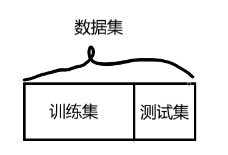
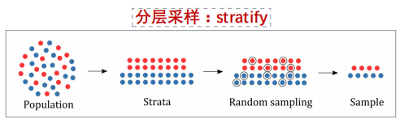
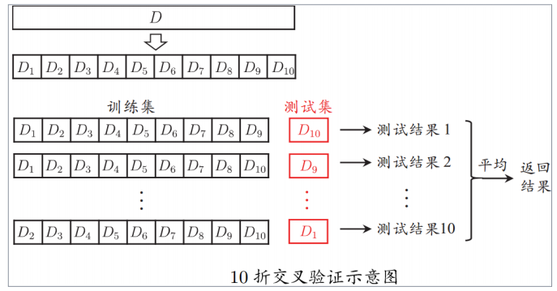
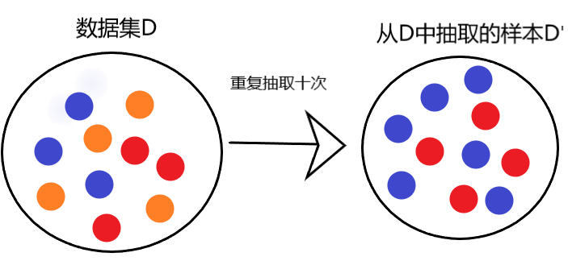
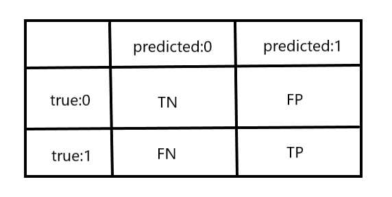
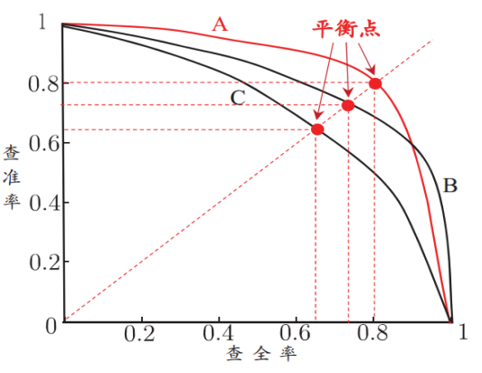
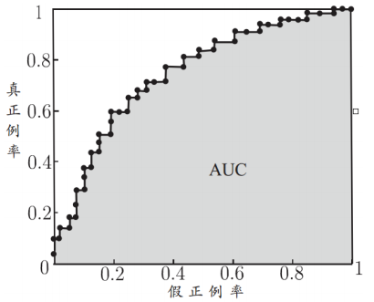
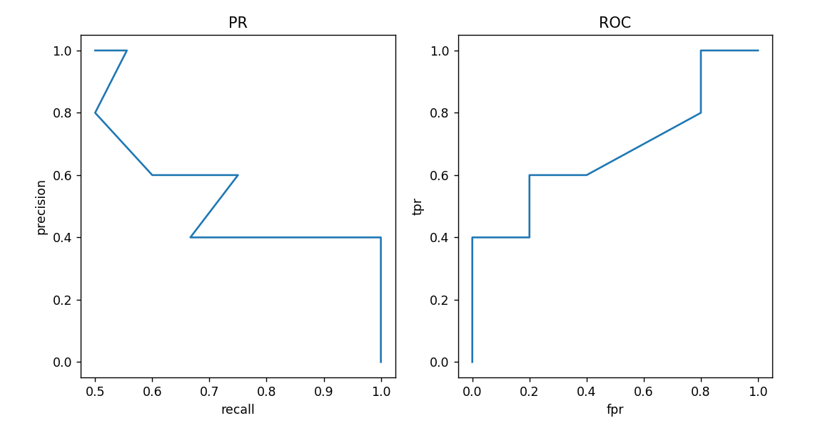
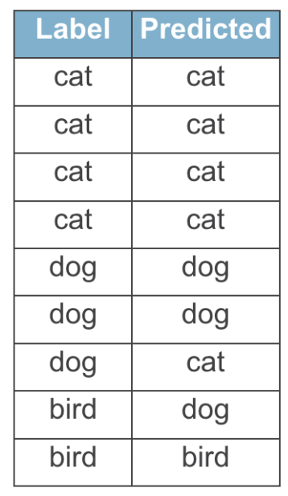
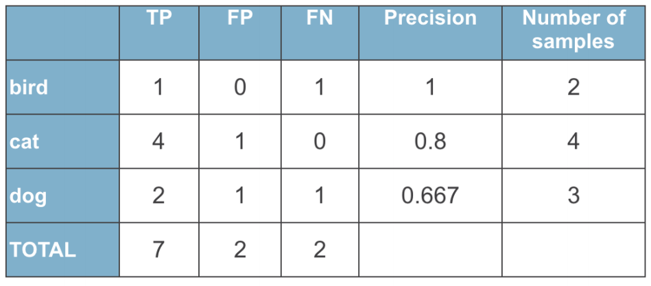

[TOC]


## 模型的评估与选择

在机器学习中，模型评估与选择是一个至关重要的步骤。通过模型评估和选择，我们可以了解模型的性能、找到最佳模型和提高预测精度。在本篇博客中，我们将深入研究机器学习中的模型评估与选择的重要性、常用的评估方法和选择最佳模型的技术，帮助读者更好地了解机器学习中的模型评估和选择。

### 1、导言

​	我们把学习器的实际预测输出与样本的真实输出之间的差异称为“误差”，学习器在训练集上的误差称为“训练误差”，在新样本上的误差称为“泛化误差”，我们实际希望的，是学习器在新样本上表现的更好，为了达到这个目的，应该从训练样本中学出适合于所有潜在样本的普遍规律，这样才能在遇到新样本时做出正确的判别。然而，当学习器把训练样本学习得”太好了“的时候，很可能就会把训练集样本自身特有的规律当作所有潜在样本的普遍规律，这种现象我们称之为”过拟合“（overfitting），相对的，如果我们在训练集中连普遍规律都没学好的话，这种现象称之为”欠拟合“（underfitting）。


### 2、评估方法

​	通常，我们通过实验测试来对学习的泛化误差进行评估而做出选择，为此我们需要将输入数据分为训练集（training set）和测试集(testing set)，将测试集中的测试误差作为泛化误差的近似，我们假设测试样本是从样本真实分布中独立同分布采样得来的。需要注意的是，测试集应该尽可能和训练集互斥，即测试样本尽量不在训练集中出现。

​	那么，我们应该怎样从输数据入中获得训练集和测试集呢？下面介绍集中常见的做法。

#### 1、留出法

​	留出法（hold-out)直接将数据集D划分为两个互斥的集合，其中一个集合作为训练集S，另一个作为测试集T，即$D=S \bigcup T,S\bigcap  T=\varnothing$。在S上训练出模型后，用T来评估其测试误差，作为泛化误差的估计。留出法通常用于样本量很大的情况。



​	让我们看看留出法在Python中用代码是怎么实现的

```python
# 导入数据集
# Iris 鸢尾花数据集是一个经典数据集，在统计学习和机器学习领域都经常被用作示例。数据集内包含 3 类共 150 条记录，每类各 50 个数据，每条记录都有 4 项特征：花萼长度、花萼宽度、花瓣长度、花瓣宽度，可以通过这4个特征预测鸢尾花卉属于（iris-setosa, iris-versicolour, iris-virginica）中的哪一品种。
from sklearn.datasets import load_iris

iris = load_iris()
X_data,y = iris.data,iris.target

print("Dataset labels{}".format(iris.target))

#用留出法划分数据集
from sklearn.model_selection import train_test_split

X_train,X_test,y_train,y_test = train_test_split(X_data,y,train_size=0.6,random_state=2)

print("Train labels\n{}".format(y_train))
print("Test labels\n{}".format(y_test))
```

​	输出结果为

```markdown
Dataset labels
[0 0 0 0 0 0 0 0 0 0 0 0 0 0 0 0 0 0 0 0 0 0 0 0 0 0 0 0 0 0 0 0 0 0 0 0 0
 0 0 0 0 0 0 0 0 0 0 0 0 0 1 1 1 1 1 1 1 1 1 1 1 1 1 1 1 1 1 1 1 1 1 1 1 1
 1 1 1 1 1 1 1 1 1 1 1 1 1 1 1 1 1 1 1 1 1 1 1 1 1 1 2 2 2 2 2 2 2 2 2 2 2
 2 2 2 2 2 2 2 2 2 2 2 2 2 2 2 2 2 2 2 2 2 2 2 2 2 2 2 2 2 2 2 2 2 2 2 2 2
 2 2]
 
 Train labels
[0 2 1 1 2 2 1 0 1 0 2 1 1 0 1 1 1 2 0 1 0 1 2 0 1 0 0 0 2 2 0 0 2 2 1 2 1
 1 2 0 2 2 2 0 2 0 0 1 2 1 2 1 1 2 1 1 1 2 1 2 1 0 1 1 1 1 2 1 0 0 2 1 2 0
 2 0 2 2 0 1 0 2 1 0 2 1 0 0 1 0]
Test labels
[0 0 2 0 0 2 0 2 2 0 0 0 0 0 1 1 0 1 2 1 1 1 2 1 1 0 0 2 0 2 2 0 1 2 1 0 2
 1 1 2 1 1 2 1 0 2 0 1 0 0 0 2 2 2 0 2 2 2 2 0]
```

​	当数据集中包含多个类别，并且每个类别的样本数不同，尤其是某些类别的样本数较少时，可以使用**分层采样**来确保每个类别的样本在训练集和测试集中都有相应的比例。分层采样划分数据主要目的是避免训练集或测试集中缺少某些类别的样本，从而导致模型训练不充分或测试结果不准确的问题。



```python
from sklearn.datasets import load_iris
from sklearn.model_selection import train_test_split
import numpy as np

iris = load_iris()
X_data,y = iris.data,iris.target

# 在python中实现分层采样非常简单，只需要在调用train_test_split()的时候设置stratify就行了
# stratify参数需要传入一个与原始数据集相同长度的一维数组，该数组用于指定目标变量的类别信息。在这种情况下，我们传递的是原始数据集中的目标变量 y。
X_train,X_test,y_train,y_test = train_test_split(X_data,y,train_size=0.6,random_state=2,stratify=y)

print("训练集中每一个类别的个数为：\n{}".format(np.bincount(y_train)))
print("测试集中每一个类别的个数为：\n{}".format(np.bincount(y_test)))
```

​	输出结果为

```
训练集中每一个类别的个数为：
[30 30 30]
测试集中每一个类别的个数为：
[20 20 20]
```

#### 2、交叉验证法

​	“交叉验证法”（cross validation）先将数据集划分为K个大小相似的互斥子集，即$D = D{_1}\bigcup D{_2}...\bigcup D{_k}, D{_i}\bigcap D{_j} = \varnothing(i \neq j)$，

每一个自己$D{_i}$都尽可能保持数据分布的一致性，即从$D$中通过分层采样得到。然后每次用$k-1$个子集的并集作为训练集；这样就可以得到$k$组训练$/$测试集，从而可以进行$k$次训练，因此交叉验证法也称为“$k$折交叉验证法”$k-$fold cross validation。$k$常用的取值为10，此时称为10折交叉验证法。下面是10折交叉验证法的示意图.



​	我们来看看在python中是怎样实现交叉验证法的，输出结果就不在这里展示了，大家复制一下自己到pycharm去实现。同样，我们在用交叉验证法的时候也会遇到某种类别的样本数特别少的情况，遇到这种情况的时候我们可以采用**$k$折交叉验证数据划分法**，在使用时只需要将下面代码中的KFold改为使用StratifiedKFold就行了，其他代码和普通的交叉验证一样，这里就不重复书写了。交叉验证法通常用于样本量不充分的情况下。

```python
from sklearn.model_selection import KFold
from sklearn.linear_model import LogisticRegression
from sklearn.datasets import load_iris
from sklearn import metrics

data = load_iris() # 获取莺尾花数据集
x = data.data
y = data.target
kf = KFold(n_splits=10,shuffle=True,random_state=1) #10折交叉验证

for train_index,test_index in kf.split(x,y):
    X_train,X_test = x[train_index],x[test_index]
    Y_train,Y_test = y[train_index],x[test_index]
    print("Train labels:\n{}".format(Y_train))
    print("Test labels:\n{}".format(Y_test))
```

#### 3、自助法

​	“自助法”（bootstrapping）也称之为有放回采样，给定$m$个样本的数据集$D$，我们对他进行采样产生数据集$D{'}$：每次随机从$D$中挑选一个样本，将其拷贝放入$D{'}$，然后再将这个样本放入初始数据集$D$中，使得该样本在下次采样时仍然有可能被采到，这个过程重复执行$m$次后，我们就得到了包含$m$个样本的数据集$D{'}$，于是我们可将$D{'}$作为训练集，$DD{'}$作为测试集，这就是自助法。自助法通常用于样本量特别少的情况下。下面我们来看看自助法的代码是怎样实现的。



```python
import numpy as np
# 产生样本
x = np.random.randint(-10,10,10)
y = (x>0).astype(int)
# bootstrapping中存储的是随机选择的样本的下标
bootstrapping = []
for i in range(len(x)):
    bootstrapping.append(np.floor(np.random.random()*len(x)))  # np.floor()返回向下取整的浮点数
X_1 = []
Y_1 = []
for i in range(len(x)):
    X_1.append(x[int(bootstrapping[i])])
    Y_1.append(y[int(bootstrapping[i])])
print(X_1)
print(Y_1)
```

```python
# 输出结果
[7, 4, 7, -3, 3, 4, -3, 5, 4, 5]
[1, 1, 1, 0, 1, 1, 0, 1, 1, 1]
```

### 3、性能度量

​		对机器学习的泛化性能进行评估，不仅需要有效可行的实验估计方法还需要有衡量模型泛化能力的评价标准，这就是性能度量（performance measure），性能度量反映了任务需求，在对比不同的模型时，使用不同的性能度量往往会导致不同的评判结果；这意味着模型的好坏是相对的，不仅取决于算法和数据，还取决于任务需求。

在评估学习器$f$的性能通常是把预测结果$f(x)$ 和数据的真实标签进行比较。（下文中把预测值$f(x)$记为 $\hat{y}$），下面介绍几种常见的性能度量。

#### 1、回归问题的性能度量

##### 	1、平均绝对误差（MAE）

$$
MAE(y,\hat{y})=\dfrac{1}{n}\sum\limits_{i=1}^n\vert {y{_i-\hat{y}}}\vert
$$

```python
MAE = np.average(np.abs(y_true-y_pre))
```


##### 	2、均方误差（MSE）

$$
MSE(y,\hat{y})=\dfrac{1}{n}\sum\limits_{i=1}^n(y{_i-\hat{y}}){^2}
$$

```python
MSE = np.average((y_true-y_pre)**2)
```


##### 3、均方根误差（RMSE）

$$
MSE(y,\hat{y})=\sqrt{\dfrac{1}{n}\sum\limits_{i=1}^n(y{_i-\hat{y}}){^2}}
$$

```python
np.sqrt(np.average((y_true-y_pre)**2))
```


* MAE，MSE，RMSE的取值范围都是从$0$到 $\infin$
* MAE 和 RMSE的单位与预测目标的单位一致，但MSE的单位不同
* MAE，MSE，RMSE的值越小，预测的效果越好
* RMSE对离群点更加敏感
* MAE对离群点更鲁棒（「Robust」，即一个系统或组织有抵御或克服不利条件的能力）

##### 4、R方系数

$$
R{^2}(y,\hat{y}) =1-\dfrac{\sum\limits_{i=1}^n(y-\hat{y}){^2}}{\sum\limits_{i=1}^n(y-\overline{y}){^2}}
$$

* $R{^2}$系数反映了预测值和实际值之间的符合程度，其值为1时，说明完美拟合，其值为0时，说明拟合的为目标的平均值
* $R{^2}$可能为负数，此时说明预测结果较真值而言过大

#### 2、分类问题的性能度量

	##### 	1、错误率和精度

   * 错误率：分错样本占样本总数的比例

* 精度：分对样本占样本总数的比例


$$
错误率:E(f;D)=\dfrac{1}{m}\sum\limits_{i=1}^m\Pi(f(x{_i})\neq y{_i})\\
精度acc(f;D)=\dfrac{1}{m}\sum\limits_{i=1}^m\Pi(f(x{_i})= y{_i})=1-E(f;D)
$$


##### 2、混淆矩阵（二分类度量指标）



* TN: True Negative
* TP: True positive
* FP: False positive
* FN: False negative

$$
查准率： Precision = \dfrac{TP}{TP+FP}\\
查全率： Recall = \dfrac{TP}{TP+FN}
$$

Precision 和Recall的侧重点不同，Precison侧重于降低FP的比例，所以注重精度，宁可漏掉，不可错杀，而Recall中与降低FN的比例，所以注重查全率，宁可错杀，不可漏掉。

##### 3、F1-score

$$
F1\enspace score =\dfrac{2*Precision*Recall}{Precison+Recall}=\dfrac{2*TP}{2*TP+FP+FN}
$$


F1-score是Precison和Recall的谐波均值，可以综合考量查准率和查全率

```python
from sklearn.metrics import precision_score,recall_score,f1_score  
print("Precison",precision_score(y_test,y_pre))
print("Recall",recall_score(y_test,y_pre))
print("F1-score",f1_score(y_test,y_pre))
```

##### 4、PR曲线

​	在很多情况下，我们可根据学习器的预测结果对样例进行排序，排在最前面的是学习器最可能认为是正例的样本，排在最后面的则是认为最不可能是正例的样本。按此顺序逐个把样本作为正例进行预测，则每次可计算出当前的查全率和查准率。以查全率为x轴，查准率为y轴，就得到了查准率-查全率曲线，简称’‘P-R曲线’‘，P-R图能直观的显示出学习器在样本总体上的查全率和查准率，在进行比较时，如果一个学习器的P-R曲线被另一个学习器的曲线完全“包住”，则可断言后者的性能由于前者。例如图中学习器A的性能优于C，若曲线出现交叉，则无法轻易断言孰优孰劣，只能在具体的查准率和查全率下进行比较。于是人们想出了“平衡点”（BEP）这一个度量，它是查准率等于查全率时的取值，例如图中学习器C的BEP是0.64，而基于BEP的比较，可认为学习器A优于B。



##### 5、ROC和AUC

​	类似于P-R曲线根据学习器预测结果对样例排序，并逐个作为正例进行预测，以“假正例率”（FPR）为横轴，“真正例率”（TPR)为纵轴可得到ROC曲线，全称“受试者工作特征”（Receiver Operating Characteristic）曲线。相比于PR曲线，ROC曲线对样本类别的比例不敏感，更能反映模型预测性能




​	若某个学习器的ROC曲线被另一个学习器的曲线“包住”，则后者性能优于前者；否者如果曲线交叉，可以根据ROC曲线下面积大小进行比较，也即AUC值。AUC 衡量了样本预测的排序质量，
$$
AUC = \dfrac{1}{2}\sum\limits_{i=1}^{m-1}(x{_{i+1}-x{_i}})*(y{_i}+y{_{i+1}})
$$

```python
import pandas as pd
import matplotlib.pyplot as plt
from sklearn.metrics import roc_auc_score,roc_curve
from sklearn.metrics import precision_recall_curve
# 导入数据
y_true = [1, 0, 0, 1, 0, 0, 1, 1, 0, 1]
y_pre = [0.9, 0.4, 0.2, 0.6, 0.5, 0.4, 0.7, 0.4, 0.65, 0.35]

# 调用这些函数时要注意，y_pre必须是预测为正例的概率
fpr,tpr,th = roc_curve(y_true, y_pre)
precision,recall,th = precision_recall_curve(y_true, y_pre)
auc_socre = roc_auc_score(y_true, y_pre)

print("auc=:{}".format(auc_socre))

# 设置画图参数
fig,ax = plt.subplots(1,2,figsize = (10,5))
ax[0].plot(precision,recall)
ax[0].set_xlabel("recall")
ax[0].set_ylabel("precision")

# 设置X,Y轴名称
ax[1].plot(fpr,tpr)
ax[1].set_xlabel("fpr")
ax[1].set_ylabel("tpr")

ax[0].set_title("PR")
ax[1].set_title("ROC")
plt.show()
```

输出

```python 
auc=:0.6799999999999999
```



#### 3、多分类问题的性能度量

​	上述中分类问题的性能度量都是针对二分类问题，那么在多分类问题中，我们应该怎样去进行性能度量呢？下面介绍几种常见的方法

我们在进行多分类问题的性能度量是，是对每一类单独求解，但对某一类进行计算时，是把这一类当成正类，其他所有类当成负类进行计算。举个例子：



在计算cat的时候，我们把cat当成正例，把所有不是cat的当成负例，所以就可以转化为

```python
Label = [1,1,1,1,0,0,0,0,0]
Predicted = [1,1,1,1,0,0,1,0,0]
```

因此，图中cat的TP为4，FP为1，FN为0

依次类推，就可以得到如下混淆矩阵：



##### 1、微（micro）查准率，查全率，F1-score

​	在计算micro-Precision，micro-Recall，micro-F1-score时，我们根据上述方法计算出每个类别的TP，FP，FN之后，把所有的TP，FP，FN加起来，即 $\overline{TP}$  = 1+4+2=7，$\overline{FP}$  =0+1+1=2 $\overline{FN}$  = 1+0+1=2 。再根据公式就可以计算得到结果。
$$
micro\text{-}P=\dfrac{\overline{TP}}{\overline{TP}+\overline{FP}}\\
micro\text{-}R=\dfrac{\overline{TP}}{\overline{TP}+\overline{FN}}\\
micro\text{-}F1 = \dfrac{2\times micro \text{-}P \times micro\text{-}R}{micro\text{-}P \times +micro\text{-}R}
$$

##### 2、宏（macro）查准率，查全率，F1-score

​	在计算macro-Precision，macro-Recall，macro-F1-score时,我们是将每一个类别的P或者R分别计算得到结果之后，再取一个平均值的到最终的结果。上面例子中三个类别的Precision分别为1,0.8，0.667，所以micro-p就是1/3(1+0.8+0.667)=0.82,Recall也是这样的算法。
$$
macro\text{-}P= \dfrac{1}{n}\sum\limits_{i=1}^nP{_i} \\
macro\text{-}R= \dfrac{1}{n}\sum\limits_{i=1}^nR{_i}\\
macro\text{-}F1 = \dfrac{2\times macro \text{-}P \times macro\text{-}R}{macro\text{-}P \times +macro\text{-}R}
$$
其中n是类别数目，$P{_i}$为第$i$类的precis，$R{_i}$为第$i$类的Recall

##### 3、Weighted-averaged查准率，查全率，F1-score

​	前面我们在计算micro和macro的时候，都是假设所有类别对最终的结果的贡献都是一样。而在Weighted-averaged中，我们认为每个类别对最终目标的贡献比由其样本数目的多少决定，即计算出每个类别的P或者R之后，乘以每个类别所占的比重就的到了Weighted-averagedP或者R。计算公式如下：
$$
Weighted-averaged\text{-}P=\dfrac{\sum\limits_{i=1}^nP{_i}*N{_i}}{\sum\limits_{i=1}^nN{_i}}\\
Weighted-averaged\text{-}R=\dfrac{\sum\limits_{i=1}^nR{_i}*N{_i}}{\sum\limits_{i=1}^nN{_i}}
$$
多分类问题性能度量的代码如下：

```python
import numpy as np
from sklearn.metrics import confusion_matrix,roc_auc_score,roc_curve
from sklearn.metrics import precision_score,recall_score

y_true = np.array([-1]*30+[0]*240+[1]*30)
y_pre = np.array([-1]*10+[0]*10+[1]*10+
                 [-1]*40+[0]*160+[1]*40+
                 [-1]*5+[0]*5+[1]*20 )


print(confusion_matrix(y_true,y_pre))

precision_micro = precision_score(y_true,y_pre,average='micro')
precision_macro = precision_score(y_true,y_pre,average='micro')
precision_weighted = precision_score(y_true,y_pre,average='weighted')

recall_micro = recall_score(y_true,y_pre,average='micro')
recall_macro = recall_score(y_true,y_pre,average='macro')
recall_weighted = recall_score(y_true,y_pre,average='weighted')

print("precision_micro is{},precision_macro is{},precision_weightedis{}".format(precision_micro,precision_macro,precision_weighted))
print("recall_micro is{},recall_macro is{},recall_weightedis{}".format(recall_micro,recall_macro,recall_weighted))
```

输出结果为

```python 
array([[ 10,  10,  10],
       [ 40, 160,  40],
       [  5,   5,  20]], dtype=int64)
precision_micro is 0.6333333333333333,precision_macro is 0.6333333333333333,precision_weighted is 0.7781818181818182
recall_micro is 0.6333333333333333,recall_macro is 0.5555555555555555,recall_weightedis 0.6333333333333333
```

好了，模型评估与选择介绍到这里就结束了。

**参考文献**
周志华.机器学习[M].北京：清华大学出版社，2016.23~36


